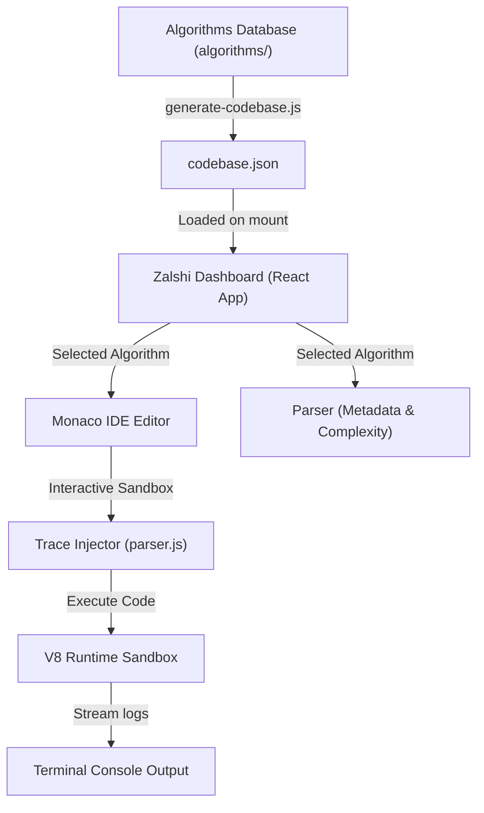

# 

> A high-performance, minimalist interactive playground and sandbox platform for JavaScript algorithms. Designed with a Supabase-inspired dark theme, local sandboxed execution, and non-intrusive trace log simulation.

---

## 🛠️ Tech Stack & Architecture

Zalshi is a **serverless, client-side React SPA** designed to let developers explore, edit, and simulate algorithms fully inside the browser.



### Key Elements:
* **The Playground**: An embedded, fully featured Monaco Editor coupled with a collapsible, resizable terminal console.
* **Shared Parser & Injector**: Powered by a robust, non-intrusive parsing engine [parser.js](src/utils/parser.js) that handles async functions, generators, classes, and loops cleanly.
* **Auto-Scroll Console**: A lightweight React terminal container that automatically snaps to the latest printed output as code executes.

---

## ⚙️ How to Run Locally

### 1. Rebuild the Codebase Index
If you add or update files in the codebase, regenerate the static index database:
```bash
node platform/scripts/generate-codebase.js
```

### 2. Launch Development Server
Start the local server and open the workspace in your browser:
```bash
cd platform
npm install
npm run dev
```

### 3. Verify Code Trace Safety
Run the compiler validation test suite to verify trace injection syntax integrity on all files:
```bash
node platform/scripts/test-trace-integrity.js
```
